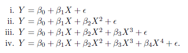

 <http://rmarkdown.rstudio.com>.

####Exercise(skipped)

####Applied
######5. In Chapter 4, we used logistic regression to predict the probability of *default* using *income* and *balance* on the *Default* data set. We will now estimate the test error of this logistic regression model using the validation set approach. Do not forget to set a random seed before beginning your analysis.

(a) Fit a logistic regression model that uses income and balance to predict default.
```{r}
library(ISLR)
default.glm.a <- glm(default ~ income + balance, data = Default, family = "binomial")

default.glm.pre.a <- predict(default.glm.a, Default)

default.glm.a.lab <- rep("No", nrow(Default))

default.glm.a.lab[which(default.glm.a.lab < .5)] <- "Yes"

mean(default.glm.a.lab == Default$default)
```


(b) Using the validation set approach, estimate the test error of this model. In order to do this, you must perform the following steps:

i. Split the sample set into a training set and a validation set.
```{r}
set.seed(1)
train_index <- sample(c(TRUE, FALSE), nrow(Default), replace = TRUE)
```

ii. Fit a multiple logistic regression model using only the training observations.
```{r}
default.glm.b <- glm(default ~ income + balance, data = Default, subset = train_index, family = "binomial")
```

iii. Obtain a prediction of default status for each individual in the validation set by computing the posterior probability of default for that individual, and classifying the individual to the default category if the posterior probability is greater than 0.5.

```{r}
default.b.pre <- predict(default.glm.b, Default[!train_index,])
default.b.pre_1 <- rep("No", length(default.b.pre))
default.b.pre_1[which(default.b.pre > .5)] <- "Yes"
```


iv. Compute the validation set error, which is the fraction of the observations in the validation set that are misclassified.
```{r}
mean(default.b.pre_1 == Default[!train_index, "default"])
```

(c) Repeat the process in (b) three times, using three different splits of the observations into a training set and a validation set. Comment on the results obtained.

1st is .9699172
2nd is .9706352
3rd is .9711382

comment: the variannt is around .002, pretty stable. the error rate is higher than the non-CV error rate, which is .9667, this is a little abnormal to me. 

(d) Now consider a logistic regression model that predicts the probability of default using income, balance, and a dummy variable for student. Estimate the test error for this model using the validation set approach. Comment on whether or not including a dummy variable for student leads to a reduction in the test error rate.

also run three times of the error code:
1st .9715
2nd .9714
3rd .9709

the average of the error code with a dummy variable for student leads to a reduction in the test error rate. 
*checked one ans in the github, it said that adding dummy variable does not leads to a reduction in the test error rate. Then, how much reduction would be accountable.*
```{r}
library(ISLR)
set.seed(1)
train_index <- sample(c(TRUE, FALSE), nrow(Default), replace = TRUE)

default.glm.d <- glm(default ~ income + balance + student, data = Default, subset = train_index, family = "binomial")

default.pre.d <- predict(default.glm.d, Default[!train_index, ])

default.pre.d_1 <- rep("No", length(default.pre.d))
default.pre.d_1[which(default.pre.d > .5)] <- "Yes"
mean(default.pre.d_1 == Default[!train_index, "default"])
```

######6. We continue to consider the use of a logistic regression model to predict the probability of default using income and balance on the Default data set. In particular, we will now compute estimates for the standard errors of the income and balance logistic regression coefficients in two different ways: (1) using the bootstrap, and (2) using the standard formula for computing the standard errors in the glm() function.Do not forget to set a random seed before beginning your analysis.

(a) Using the *summary()* and *glm()* functions, determine the estimated standard errors for the coefficients associated with *income* and *balance* in a multiple logistic regression model that uses both predictors.

std error: 
income: 4.985167e-06
balance: 2.273731e-04
```{r}
# set.seed(1)

# summary(glm(default ~ income + balance, data = data, subset = index, family = "binomial"))$coef

standard_form_part <- function(data, index)
  return (summary(glm(default ~ income + balance, data = data, subset = index, family = "binomial"))$coef)
```


(b) Write a function, boot.fn(), that takes as input the Default data set as well as an index of the observations, and that outputs the coefficient estimates for income and balance in the multiple logistic regression model.
(c) Use the boot() function together with your boot.fn() function to estimate the standard errors of the logistic regression coefficients for income and balance.
(d) Comment on the estimated standard errors obtained using the glm() function and using your bootstrap function.

The income std error is: 4.785130e-06  
the balance std error is: 2.249343e-04  

Using boot std.error seems (very little) smaller than the standard one. I use R = 100 times. 

*special note:* in boot.fn, I tried the summary(glm())$coef, it turned out there are t1 to t12, quite confusing. 
But after I changed to coef(glm()), it back to normal. I'm not sure if I used a wrong function. 

```{r}
boot.fn <- function(data, index){
  return (coef(glm(default ~ income + balance, data = data, subset = index, family = "binomial")))
}

library(boot)
boot(Default, boot.fn, R = 100)

boot.fn(Default, 1:400)
```

7. In Sections 5.3.2 and 5.3.3, we saw that the cv.glm() function can be used in order to compute the LOOCV test error estimate. Alternatively, one could compute those quantities using just the glm() and predict.glm() functions, and a for loop. You will now take this approach in order to compute the LOOCV error for a simple logistic regression model on the Weekly data set. Recall that in the context of classification problems, the LOOCV error is given in (5.4).

(a) Fit a logistic regression model that predicts *Direction* using *Lag1* and *Lag2*.
```{r}
library(ISLR)
direct.glm <- glm(Direction ~ Lag1 + Lag2, data = Weekly, family = "binomial")
```

(b) Fit a logistic regressionmodel that predicts Direction using Lag1 and Lag2 using all but the first observation.
```{r}
direct.glm_1st <- glm(Direction ~ Lag1 + Lag2, data = Weekly[-1, ], family = "binomial")
```

(c) Use the model from (b) to predict the direction of the first observation. You can do this by predicting that the first observation will go up if P(Direction="Up"|Lag1, Lag2) > 0.5. Was this observation correctly classified?
  
The observation is >.5, so the answer is up. 
But the actual ans is "Down", so the predict is wrong. 
```{r}
predict(direct.glm_1st, Weekly[1, ], type = "response")
Weekly[1, 'Direction']
names(Weekly)
```

(d) Write a for loop from i = 1 to i = n, where n is the number of observations in the data set, that performs each of the following steps:

i. Fit a logistic regression model using all but the ith observation to predict Direction using Lag1 and Lag2.

ii. Compute the posterior probability of the market moving up for the ith observation.

iii. Use the posterior probability for the ith observation in order to predict whether or not the market moves up.

iv. Determine whether or not an error was made in predicting the direction for the ith observation. If an error was made, then indicate this as a 1, and otherwise indicate it as a 0.

```{r}
library(ISLR)
one_step <- function(data, index){
  temp_glm <- glm(Direction ~ Lag1 + Lag2, data = data[-index, ], family = "binomial")
  temp_glm_pre <- predict(temp_glm, data[index, ], type = "response")
  if (temp_glm_pre > .5){
    temp_label = "Up"
  }
  else temp_label = "Down"
  
   temp_corr = 0
  if (temp_label != data[index, "Direction"]){
    temp_corr = 1
  }
#    is_up = predict.glm(temp_glm, Weekly[index,], type="response") > 0.5
#    is_true_up = Weekly[index,]$Direction == "Up"
#    if (is_up != is_true_up)
#      temp_corr = 1
  
  return (temp_corr)
}
head(Weekly$Direction)

error_rate <- 0
for (i in 1:nrow(Weekly)) {
  error_rate <- error_rate + one_step(Weekly, i)
}
error_rate
```

the following is provided by the git hub, need to check where is the difference. 
*the logic relationship is wrong.*
```{r}
count = rep(0, dim(Weekly)[1])
for (i in 1:(dim(Weekly)[1])) {
   glm.fit = glm(Direction~Lag1+Lag2, data=Weekly[-i,], family=binomial)
   is_up = predict.glm(glm.fit, Weekly[i,], type="response") > 0.5
   is_true_up = Weekly[i,]$Direction == "Up"
   if (is_up != is_true_up)
     count[i] = 1
}
sum(count)
```

(e) Take the average of the n numbers obtained in (d)iv in order to obtain the LOOCV estimate for the test error. Comment on the results.

the error rate is 490/1089 = .45
```{r}
490/1089
```

8. We will now perform cross-validation on a simulated data set.
(a) Generate a simulated data set as follows:
In this data set, what is n and what is p? Write out the model used to generate the data in equation form.  

-- n is y, p is x, and x^2. 
*Question:* try to use the lm(y ~ x + I(x^2)) would be similar but use lm(y ~ poly(x, 2)) does not similar. What is the differentce between the x + I(x^2) and poly(x, 2)
```{r}
set.seed(1)
y=rnorm(100)
x=rnorm(100)
y=x-2*x^2+rnorm(100)

cv_8.glm <- lm(y ~ x + I(x^2))
cv_8.glm.poly <- lm(y ~ poly(x, 2, raw = TRUE))
summary(cv_8.glm)$coef
summary(cv_8.glm.poly)$coef
```

(b) Create a scatterplot of X against Y . Comment onwhat you find.

--the relationship is a curve. 
```{r}
plot(y ~ x)
```

(c) Set a random seed, and then compute the LOOCV errors that result from fitting the following four models using least squares:
  
Note you may find it helpful to use the data.frame() function to create a single data set containing both X and Y .  

--get the poly1_error is 589.0979; get the poly2_error is 108.6596; poly3_error is 110.2585; poly4_error is 111.4772
```{r}
X_Y <- data.frame("Y" = y, "X" = x)
poly1_error <- 0
poly2_error <- 0
poly3_error <- 0
poly4_error <- 0
for (i in 1:nrow(X_Y)){
  Q8.lm_poly_1 <- lm(Y ~ X, data = X_Y[-i, ])  
  Q8.lm_poly_2 <- lm(Y ~ poly(X, 2), data = X_Y[-i, ])
  Q8.lm_poly_3 <- lm(Y ~ poly(X, 3), data = X_Y[-i, ])  
  Q8.lm_poly_4 <- lm(Y ~ poly(X, 4), data = X_Y[-i, ])
  
  poly1_error <- poly1_error + (predict(Q8.lm_poly_1, X_Y[i, ]) - X_Y[i, "Y"])^2
  poly2_error <- poly2_error + (predict(Q8.lm_poly_2, X_Y[i, ]) - X_Y[i, "Y"])^2
  poly3_error <- poly3_error + (predict(Q8.lm_poly_3, X_Y[i, ]) - X_Y[i, "Y"])^2
  poly4_error <- poly4_error + (predict(Q8.lm_poly_4, X_Y[i, ]) - X_Y[i, "Y"])^2
}
poly1_error
poly2_error
poly3_error
poly4_error
```

--Here is from the github ans. It use the formular to check the cv error data.
```{r}
library(boot)
glm.fit = glm(Y ~ X, data = X_Y)
summary(glm.fit)$coef
cv.glm(X_Y, glm.fit)$delta

glm.fit2 = glm(Y ~ poly(X, 2), data = X_Y)
summary(glm.fit2)$coef
cv.glm(X_Y, glm.fit2)$delta

glm.fit3 = glm(Y ~ poly(X, 3), data = X_Y)
cv.glm(X_Y, glm.fit3)$delta

glm.fit4 = glm(Y ~ poly(X, 4), data = X_Y)
cv.glm(X_Y, glm.fit4)$delta
```

(d) Repeat (c) using another random seed, and report your results. Are your results the same as what you got in (c)? Why?

-- I though the LOOCV not need the random choice. Maybe just because I'm not familiar with the LOOCV very much. 


(e) Which of the models in (c) had the smallest LOOCV error? Is this what you expected? Explain your answer.

-- the poly 1 has the least test error. I thought the poly 2 should have the least test error.   
-- after using the cv.glm and found the poly 2 is the smallest test error. 
-- just found I minus a wrong data, after correction, the error rate of poly 2 is the smallest.

(f) Comment on the statistical significance of the coefficient estimates that results from fitting each of the models in (c) using least squares. Do these results agree with the conclusions drawn based on the cross-validation results?

-- not sure how to check the agreement between the conclusions drawn based on the CV, with the coef summary. 
```{r}
summary(Q8.lm_poly_1)$coef
summary(Q8.lm_poly_2)$coef
summary(Q8.lm_poly_3)$coef
summary(Q8.lm_poly_4)$coef
```


9. We will now consider the Boston housing data set, from the MASS library.

(a) Based on this data set, provide an estimate for the population mean of medv. Call this estimate mu.  
-- population mean is 22.53281
```{r}
library(MASS)
mean(Boston$medv)
```

(b) Provide an estimate of the standard error of mu. Interpret this result. Hint: We can compute the standard error of the sample mean by dividing the sample standard deviation by the square root of the number of observations.  
-- std error is .4084569. the variation of the medv would between mu +/- std error by 95%?

-- It seems the calculation is wrong. 
```{r}
mu <- mean(Boston$medv)
std_err <- (sum((Boston$medv - mu)^2))^.5 / nrow(Boston)
```

-- list github ans here
```{r}
sd(Boston$medv) / sqrt(length(Boston$medv))
```

(c) Now estimate the standard error of mu using the bootstrap. How does this compare to your answer from (b)?  
-- *special note:* boot.fn function must have the index parameter.   
-- the original one is same as the question b, original is .4084569, bias is .0006325, std.error is .017719
```{r}
library(boot)
boot.fn <- function(data, index){
  mu = mean(data[index])
  return ((sum((data[index] - mu)^2))^.5/ length(data[index]))
}

boot(Boston$medv, boot.fn, R = 1000)

```

-- github ans is like: 
```{r}
boot.fn_mean <- function(data, index){
  return (mean(data[index]))
}
boot(Boston$medv, boot.fn_mean, 1000)
```

(d) Based on your bootstrap estimate from (c), provide a 95 % confidence interval for the mean of medv. Compare it to the results obtained using t.test(Boston$medv).  
-- [21.72, 23.35]  
-- 95 percent confidence interval: 21.72953 23.33608, similar to the t.test(Boston$medv)
```{r}
lower <- mu - 2*std_err
upper <- mu + 2*std_err 
lower
upper
t.test(Boston$medv)
```

(e) Based on this data set, provide an estimate, μ(med) ,for the median value of medv in the population.

```{r}
mu_med <- median(Boston$medv)
```

(f) We now would like to estimate the standard error ofμˆmed.Unfortunately, there is no simple formula for computing the standard error of the median. Instead, estimate the standard error of the median using the bootstrap. Comment on your findings.  
-- original is .412732, bias is .00188892, std.error is .01563807. The median's bias is larger than mean. 
```{r}
boot.fn_med <- function(data, index){
  mu_med = median(data[index])
  return ((sum((data[index] - mu_med)^2))^.5/length(data[index]))
}
boot(Boston$medv, boot.fn_med, R = 100)
```

-- github ans is like: 
```{r}
boot.fn_med1 <- function(data, index){
  return (median(data[index]))
}
boot(Boston$medv, boot.fn_med1, 100)
```

(g) Based on this data set, provide an estimate for the tenth per- centile of medv in Boston suburbs. Call this quantity μ<sub>0.1.</sub> (You can use the quantile() function.)  
-- estimate for the tenth percentile of medv is 12.75
```{r}
quantile(Boston$medv, 0.1)
```

(h) Use the bootstrap to estimate the standard error of μˆ0.1. Comment on your findings.  
-- orginal is still the same as the estimate one. the std.error is large, maybe this is because in the edge of the data set, the more large variant it is. 
```{r}
boot.fn_10per <- function(data, index){
  return (quantile(data[index], .1))
}

boot(Boston$medv, boot.fn_10per, R=100)
```

