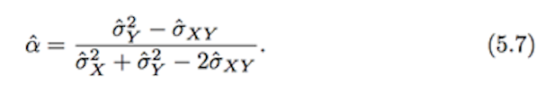

| Type | Subtype | Method | Merit | Demerit | modeling |
| --- | --- | --- | --- | --- | --- |
| Cross-Validation | --- | --- | --- | ---| --- |
| 1 | valid set | split the data into half, one is training data, the other is test data | --- | --- | --- |
| 2 | Leave-One-Out CV | a single observation is used for validation, should use from the first to last row of data | unbiased due to more data than item 1 - valid set/ no randomness in the training or validation set splits. ==> run LOOCV multiple times will yield the same results.  | highly variable (due to single observation) | can be used with any kind of predictive modeling, like logistic regression/ linear discriminant analysis |
| 3 | k-Fold Cross-Validation | alternative to LOOCV/ randomly dividing the set of observation into k groups: the first fold is set as a vaildation set, the method is fit on the remaining k-1 folds. The procedure is repeated k times. The k-fold CV is estimate is computed by averaging the values. function 5.3 page 195| CV curves come close to identify the correct level of flexibility; more accurate estimates (lower variance than LOOCV) of the test error than does LOOCV | *TBC* | *TBC* |
| 5 | CV on classification problem | *TBC* | *TBC* | *TBC* | *TBC* |
| Bootstrap (page 201) | --- | use computer to emulate the process of obtaining new sample sets. Rather than repeatedly obtaining independent data sets from the population, we instead obtain distinct data sets by repeatly sampling observations from the original data set; 1. create a function that computes the statistic of interest; 2. use boot() function which is in boot library, to perform the bootstrap by repeatly sampling observations from the dataset with replacement. | to quantify the uncertainty associated with a given estimator or statistical learning method. e.g. to estimate the std of the coef from a linear regression fit;  be easily applied to a wide range of statistical learning method, including some for which a measure of variability is otherwise difficult to obtain and is not automatically output by statistical software | ---| --- |

Comparison is based in the page 210
| Function | Assumption | Assumption2 | Merit | Demerit | modeling |
| lm.function | depend on unknow parameter σ<sup>2</sup>, its estimation by using the RSS, σ<sup>2</sup> estimation rely on the linear model being correct. | assume the x<sub>i</sub> | --- | --- | --- |
| boot.function | --- | --- | --- | --- | --- |


###Cross-Validation
####1. Valid Set
####from page 190 lab from 205 

**example @ 5.1.1**
*purpose:* to check which regression function is better  
*method:* to make split the dataset into two part.   
*result:* the poly(horsepower, 2) show more lower error rate. 
```{r}
library(ISLR)
set.seed(1)
set.seed(2)
train_index = sample(c(TRUE, FALSE), size = nrow(Auto), replace = TRUE, prob = c(.5, .5))

# make the plot for n = 1:10 error rate with same train_index
make_poly_1st <- function(n, train_index){
  temp.test_error <- NULL
  poly_num <- NULL
  
  for (i in 1:n) {
    temp.lm = lm(mpg ~ poly(horsepower, i), data = Auto, subset = train_index)
    temp.lm.pre = predict(temp.lm, Auto[!train_index, ])
    temp.test_error <- c(temp.test_error, mean((Auto[!train_index, "mpg"] - temp.lm.pre)^2))
    poly_num <- c(poly_num, i)
    
  }
  
  poly_test_err <- data.frame("poly" = poly_num, "test_err" = temp.test_error)
  return (poly_test_err)
}

# for 10 different train_index, check the n=1:10 error rate. 
make_poly_10 <- function(){
  for (i in 1:10){
    set.seed(i)
    train_index <- sample(c(TRUE, FALSE), size = nrow(Auto), replace = TRUE, prob = c(.5, .5))
    if (i == 1)
      {
      temp_data <- make_poly_1st(10, train_index)
      plot(test_err ~ poly, data = temp_data, type = "b", ylim = range(15, 28))
      # print (head(temp_data))
      }
    else
      {
      temp_data <- make_poly_1st(10, train_index)
      lines(temp_data$test_err, type = "b", col = i)
      # print (head(temp_data))
      }
    
  }
}

make_poly_10()
```

####2. Leave One Out CV 
#####from page 192

**example @ 5.1.2**
*purpose:* to valid the figure 5.4
*method:* random choose one as the test data, and the rest of the data is the training data. 
*result:* the error is largely variable.   
*notice:* the following method is wrong. the LOOCV should calculate all the records of data, which means, if you have 100 rows of data, you need to do the LOOCV 100 times. Then you could get the error rate. 
```{r}
library(ISLR)
make_LOOCV_poly <- function(n, train_index){
  poly_temp <- NULL
  test_err <- NULL
  for (i in 1:n ) {
    temp.lm = lm(mpg ~ poly(horsepower, i), data = Auto, subset = train_index)
    # print (summary(temp.lm)$coef)
    temp.pre = predict(temp.lm, Auto[!train_index, ])
    test_err <- c(test_err, mean((Auto[!train_index, "mpg"] - temp.pre)^2))
    poly_temp <- c(poly_temp, i)
  }
  
  return (temp_data <- data.frame("poly_temp" = poly_temp, "test_err" = test_err))
}

make_LOOCV_plot <- function() {
  for (i in 1:10){
    set.seed(i)
    train_index_0 <- sample(1:nrow(Auto), 1, replace = FALSE)
    train_index <- sample(TRUE, size = nrow(Auto), replace = TRUE)
    train_index[train_index_0] <- FALSE
    
    temp_data <- make_LOOCV_poly(10, train_index)
    # print (temp_data)
    if (i == 1) {
      plot(test_err ~ poly_temp, type = 'b', data = temp_data, ylim = range(0, 150), xlim = range(0, 12))
    }
    else {
      lines(temp_data$poly_temp, temp_data$test_err, type = 'b', col=i)
    }
  }
}

make_LOOCV_plot()

```

####3. k-fold CV
#####from page ...
**example @ 5.1.3**
*purpose:* to valid the figure 5.4, right side (page 194)
*method:* random split the data into 10 fold, and choose the 1st fold as the validation set while others are the training data. 
*result:* 
*notice:* 
```{r}
make_nFOLD_poly <- function(n, train_index){
  test.err <- NULL
  poly_temp <- NULL
  for ( i in 1:n ) {
    temp.lm <- lm(mpg ~ poly(horsepower, i), data = Auto, subset = train_index)
    temp.pre <- predict(temp.lm, data = Auto[!train_index, ])
    test.err <- c(test.err, (temp.pre - Auto[!train_index, 'mpg']) ^ 2)
    poly_temp <- c(poly_temp, i)
  }
  return (temp_data <- data.frame("poly_temp" = poly_temp, "test.err" = test.err))
}

# train_data(Auto)

rep(0, 10)
```

**Lab @ 5.1.3** page 207
*purpose:* to check if above is correct/ leverage the example's method
*question:* the first one is the example in the book, the later one is I tried. But the variation is very small, and I'm not sure if there is anything wrong here.  If you make the fold increased, you will see the variation is also increased. 
```{r}
library(boot)
set.seed(17)
cv.error.10 = rep(0, 10)
for ( i in 1:10 ) {
  glm.fit = glm(mpg ~ poly(horsepower, i), data = Auto)
  cv.error.10[i] = cv.glm(Auto, glm.fit, K= 10)$delta[1]
}
cv.error.10

make_data_w_k_index <- function(origin_data, k){
  n <- sample(1:100, 1, replace = TRUE)
  set.seed(n)
  # print (n)
  train_index_0 <- rep_len(1:k, length.out = nrow(origin_data))
  train_index_0 <- sample(train_index_0, size = length(train_index_0), replace = FALSE)
  # print (head(train_index_0))
  origin_data_temp <- origin_data
  origin_data_temp["k_index"] = train_index_0
  # print (head(origin_data_temp, 2))
  return (origin_data_temp)
}

make_mFOLD_yPOLY <- function(m, y, data_w_k_index){
  cv.error.m <- NULL
  poly <- NULL
  for (n in 1:y) {
    temp.lm <- lm(mpg ~ poly(horsepower, n), data = data_w_k_index)
    cv.error.temp <- NULL
    # print (head(data_w_k_index$k_index))
    for (i in 1:m){
      temp.pre <- predict(temp.lm, data_w_k_index[which(data_w_k_index$k_index == i), ])
      temp.error <- mean((temp.pre - data_w_k_index[which(data_w_k_index$k_index == i), "mpg"])^2)
      cv.error.temp <- c(cv.error.temp, temp.error)
    }
    cv.error.m <- c(cv.error.m, mean(cv.error.temp))
    # print(cv.error.m)
    poly <- c(poly, n)
  }
  data.temp <- data.frame("poly" = poly, "cv.err" = cv.error.m)
  # print (data.temp)
  return (data.temp)
}

print(make_mFOLD_yPOLY(10, 2, make_data_w_k_index(Auto, 10)))

cv.data_temp <- NULL
for (i in 1:9){
  cv.data_temp <- make_mFOLD_yPOLY(40, 10, make_data_w_k_index(Auto, 40))
  if (i == 1){
    plot(cv.err ~ poly, data = cv.data_temp, type = 'b', ylim = range(15, 24.5), xlim = range(0, 12))
  }
  else {
    lines(cv.data_temp$poly, cv.data_temp$cv.err, col = i, type = 'b')
  }
}
```

####4. bootstrap
**example @ lab page 208**
*purpose:* to familiar with the bootstrap
*method:* 1. make function; 2. use boot() function. 
*function of alpha:* 
*data:* Portforlio
```{r}
alpha.fn = function(data, index) {
  X = data$X[index]
  Y = data$Y[index]
  return ((var(Y) - cov(X, Y)) / (var(X) + var(Y) - 2*cov(X, Y)))
}

alpha.fn(Portfolio, 1:100)

set.seed(1)
alpha.fn(Portfolio, sample(100, 100, replace = T))

boot(Portfolio, alpha.fn, R = 1000)
```

*method:* still bootstrap
*data:* Auto
*question:* Even if the alpha is calculated, how could we use this data to do further prediction? 
*comparision:* There are some comparison between the bootstrap and the lm function between the mpg ~ horsepower, in the Auto data. 

```{r}
alpha.mpg = function(data, index) {
  X = data$horsepower[index]
  Y = data$mpg[index]
  return ((var(Y)-cov(X,Y)) / (var(X) + var(Y) - 2*cov(X, Y)))
}
alpha.mpg(Auto, 1:nrow(Auto))
boot(Auto, alpha.mpg, R = 1000)

library(ISLR)
boot.fn = function(data, index) 
  return (coef(lm(mpg~horsepower, data = data, subset = index)))
boot.fn(Auto, 1:392)

coef(lm(mpg~horsepower, data = Auto))
nrow(Auto)

set.seed(1)
boot.fn(Auto, sample(392, 392, replace = TRUE))
boot.fn(Auto, sample(392, 392, replace = TRUE))

# get the coef from Bootstrap
set.seed(1)
library (boot)
boot(Auto, boot.fn, 1000)
# get the coef from the lm function
summary(lm(mpg~horsepower, data = Auto))$coef
```

note to color the work in the HTML
<span style="color:orange"> xxx </span>  
