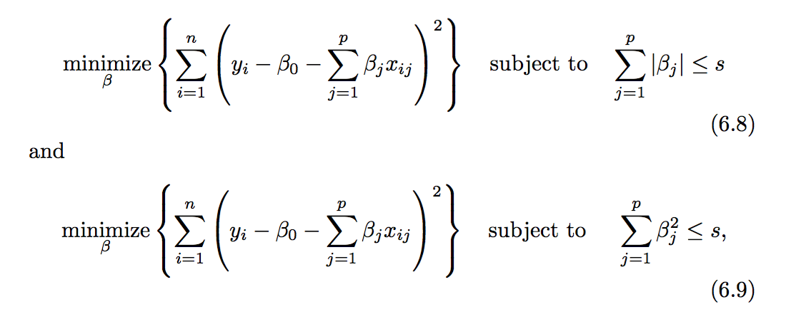
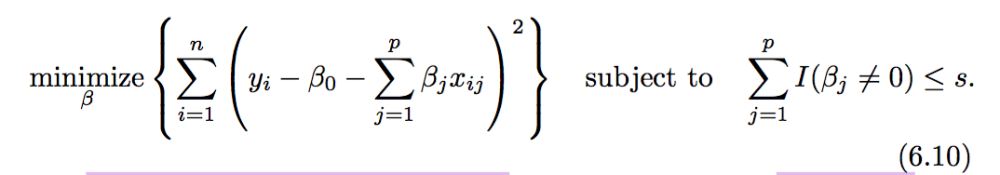
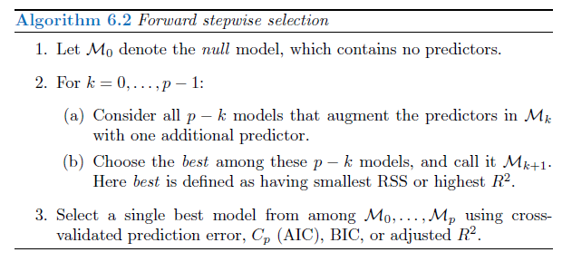
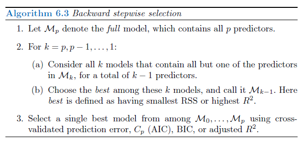

##Chapter Purpose: 
####Prediction Accuracy: 
1. n >> p (low-dimensional): the LEAST SQUARES estimates tend to also have low variance, and hence will perform well on test observation
2. n not >> p : a lot of variability in the LEAST SQUARES fit --> overfitting --> poor prediction 
3. n < p (high-dimentional): the variance is infinite so the LEAST SQUARES cannot be used at all. By constraining or shrinking the estimated coef, we can often substantially reduce the variance at the cost of a negligible increase of bias. (Not sure how to make estimation from this condition. )

####Model Interpretability: 
| Methods | Select Judgement | Fault | Merit | R_function |
| --- | --- | --- | --- | --- |
| Subset | --- | --- | --- | --- |
| --- | --- | --- | --- | --- |
| Best Subset Selection | CV prediction error, C<sub>p</sub>, BIC, or ajusted R<sup>2</sup> | computational limitations: the number of possible models that must be considered grows rapidly as *p* increases.It becomes computationally infeasible for values of p greater than 40 | simple and conceptually appealing approach | regsubsets()/ *leaps library*/ =>  summary() could return R<sup>2</sup>, RSS, adjusted R<sup>2</sup>, C<sub>p</sub>, BIC => coef(regfit.full, 6) 6 predictors combination with their coef |
| Forward Stepwise Selection | *same as above* | not guarantee to find the best possbile model | computationally efficient / high-dimensional setting where n < p, but may not yield a unique solution | --- |
| Barkward Stepwise Selection | *same as above* | *same as above* | computationally efficient / high-dimensional setting but request n > p, may not yield a unique solution | --- |
| --- | --- | --- | --- | --- |
| Shrinkage | --- | --- | --- | --- |
| --- | --- | --- | --- | --- |
| Dimension Reduction | --- | --- | --- | --- |
| High-Dimensional Data | --- | --- | --- | --- |
=======
| Subset Selection | the most important: low test error. others: CV prediction error, C<sub>p</sub>, BIC, or ajusted R<sup>2</sup> | computational limitations: the number of possible models that must be considered grwos rapidly as *p* increases.It becomes computationally infeasible for values of p greater than 40 | simple and conceptually appealing approach | regsubsets()/ *leaps library*/ use summary() could return R<sup>2</sup>, RSS, adjusted R<sup>2</sup>, C<sub>p</sub>, BIC  |
| Shrinkage | smallest cross validation error to determine lamda | --- | --- | --- |
| Dimension Reduction | --- | serves to constrain the estimated beta<sub>j</sub>. this constraint has the potential to bias the coeffient estimates. | use in situations where p is large relative to n, selecting a value of M << p can significantly reduce the variance of the fitted coef | --- |

####(w 6.1)Choose Optimal Model with C<sub>p</sub>, AIC, BIC and Ajusted R<sup>2</sup>: 
####<span style="color:orange"> Skipped for now. </span>  
| Item | --- | --- |--- | --- |
| --- | --- | --- |--- | --- |
| C<sub>p</sub> | --- | --- | --- | --- |
| AIC (Akaike information criterion) | --- | --- | --- | --- |
| BIC (Bayesian information criterion) | --- | --- | --- | --- |
| Adjusted R<sup>2</sup> | --- | --- | --- | --- |

####(w 6.2)Shrinkage Methods:   
A technique such as cross-validation can be used in order to determine which approach (ridge or lasso) is better on a particular data set.   
Ridge performs better when the response is a function of many predictors, all with coefficients of roughly equal size.   
Lasso performs better in a setting where a relatively small number of predictors have substantial coefficients, and the the remaining predictors have coefficients that are very small or that equal to zero.  
As with ridge regression, when the least squares estimates have excessively high variance, the lasso solution can yield a reduction in variance at the expense of a small increase in bias, and consequently can generate more accurate predictions.   
Unlike ridge regression, the lasso performs vairable selection, and hence results in models that are easier to interpret. 


| Item | Explanation | Shrinkage Penalty | Important | Note | Benefit | Disadvantage | Work Best Situation |
| --- | --- | --- | --- | --- | --- | --- | --- |
| Ridge Regression (page 229)| similar to least squares, except that the coef are estimated by minimizing a slightly different quantity. <span style="color:orange"> check the 6.5, page 229 </span> | the second term: lambda = 0, penalty term no effect; lambda -> infinite, the penalty increase, and the ridge regression coef estimates will approach zero. | select a good value for lambda | apply ridge regression after standardizing the predictors, because scale equivariant will also impact the value of X<sub>j</sub>Beta<sub>j</sub>/ formula 6.6 page 231 | bias-variance trade-off: lambda increase --> the flexibility of the ridge regression fit decrease --> decrease variance increase bias --> impact the test mean squared error mean // computation advantages over best subset selection | include all p predictors, which is not a problem for prediction accuracy, but create a challenge in model interpretation | the relationship between the response and the predictors is close to linear. least squares estimations have high variance but low bias, like: p > n or p is almost as large as n |
| Lasso (page 233) | *Difference from Ridge:* ell 1 penalty has the effect of forcing some of coef estimates to be exactly to zero ==> performs variable selection | same as ridge | --- | --- | --- | overcome Ridge's disadvantage | --- |

####Another fomulation: 


when p = 2,   
the lasso coef estimates have the smallest RSS out of all points that lie within the diamond defined by |beta<sub>1</sub>| + |beta<sub>2</sub>| <= s.   
the ridge regression estimates have the smallest RSS out of all points that lie within the circle defined by beta<sub>1</sub><sup>2</sup> + beta<sub>2</sub><sup>2</sup> <= s.  
Note: if s is large enough, coef is just as the least squares; if s is small enough, variable selection.
  
Fomulation 6.8 and 6.9 reveals a close connection between the lasso, ridge regression, and the best selection.   
6.10 amounts to finding a set of coefficient estimates such that RSS is as small as possible. Unfortunately solving 6.10 is computationally infeasible when p is large.  
Therefore, we can interpret ridge regression and the lasso as computationally feasible alternatives to best subset selection. 

####(w 6.3)Dimension Reduction Methods (Page 242):   
A class of approaches that transform the predictors and then fit a least squares model using the transformed variables.   
  
#####Two Steps:
1. Principal Components Analysis(PCA): transformed predictors Z<sub>1</sub>, Z<sub>2</sub>, ..., Z<sub>M</sub> are obtained.   
*the first/(till p) principal component* vector definces the line that is as close as possbile to the data/ *the first/(till p) principal component* direction of the data is that along which the observations vary the most.   
In general, one can construct up to *p* distinct principal components. The second principal component Z<sub>2</sub> is a linear combination of the variables that is uncorrelated with Z<sub>1</sub>, and has largest variance subject to this constraint. Z<sub>1</sub> and Z<sub>2</sub> is zero correlation == their direction must be *perpendicular*; The first component will contain the most information.  
  
2. Principal Components Regression (PCR): the model is fit using these M preidctors.   
If the assumption underlying PCR holds, then fitting a least squares model to Z<sub>1</sub>, ..., Z<sub>M</sub> will lead to better results than fitting a least squares model to X<sub>1</sub>, ..., X<sub>p</sub>, since most or all of the information in the data that relates to the response is contained in Z<sub>1</sub>, ..., Z<sub>M</sub>, and by estimating only M << p coefficients we can mitigate overfitting. 


| Item | Preparation | Advantage | Disadvantage | Note |
| --- | --- | --- | --- | --- |
| Principal Components Regression (PCR) | standardizing each predictor, using (6.6). But if the variables are all measured in the same units, then one might choose not to standardize them. | will tend to do well in cases when the first few principal components are sufficient to capture most of the variation in the predictors as well as the relationship with the response. | the directions, which to best represent the predictors, are identified in an *unsupervised way*, since Y is not used to help determine the principal component directions. ==> there is no guarantee that the directions that best explain the predictors will also be the best directions to use for predicting the response.| provides a simple way to perform regression using M < p predictors, it is *not a feature selection method*, because each of the M principal components is a linear combination of all p of the original features. ==> PCR and ridge regression are very closely related. or one can even think of ridge regression as a continuuous version of PCR. |
| Partial least squares (PLS) | --- | makes use of the response Y in order to identify new features that not only approximate the old features weel, but also that are related to the response. / attempts to find directions that help explain both the response and the predictors. | In practice, it often performs no better than ridge regression or PCR. While the supervised dimension reduction of PLS can reduce bias, it also has the potential to increase variance, so that the overall benefit of PLS relative to PCR is a wash. | <span style="color:orange"> Skipped for now.</span>|

####<span style="color:orange"> Question (page 245) </span>    
Why the resulting projected observations would have the largest possible variance??
>>>>>>> 9695a787014cd5f01d9de3fa229995cce533d253


####(w 6.4.1)High-Dimensional Data:   
| Method | Method Unavailable | Method Available |
| --- | --- | --- |
| least squares linear regression | x | --- |
| logistic regression | x | --- |
| linear discriminant analysis | x | --- |
| other classical statistical approaches | x | --- |
| C<sub>p<\sub> | x | --- |
| AIC | x | --- |
| BIC | x | --- |
| adjusted R<sup>2<\sup> | x | --- |
| --- | --- | fitting less flexible least squares models |
| forward stepwise selection | --- | x |
| ridge regression | --- | x |
| lasso | --- | x |
| principal components regression | --- | x |

  
Notice: 
Adding additional signal features that are *truly associated* with the response will improve the fitted model. However, adding noise features that are not truly associated with the response will lead to a deterioration in the fitted model, and consequently an increased test set error.   
This is because noise features increase the dimentionality of the problem, exacerbating the risk of overfitting. 

#####High Dimensions Problem: 
When the number of features p is as large as, or larger than, the number of observations n, least squares cannot (or rather, should not) be preformed.   
  
The reson is: least squares will yield a set of coefficient estimates that result in a perfect fit to that data, such that the residuals are zero.(because the data qty could be used is just one or two)  
Pefect fit will almost certainly lead to overfitting of the data. The resulting linear model will perform extremely poorly on an independent test set, and therefore does not constitue a useful model.  
  
The importance of applying extra care when analyzing data sets with a large number of variables, and of always evaluating model performance on an indepedent test set. 
  
###6.1 Subset Selection<Page 219>
####1. Best Subset Selection
####from page 219 lab from 258   

Algorithm 6.1


**Lab.6.5.1: Best Subset Selection**
*purpose:* to practice the best subset selection  
*method:* regsubsets()/ in library(leaps)   
*result:*  
```{r}
library(ISLR)
names(Hitters)
sum(is.na(Hitters))
Hitters = na.omit(Hitters)

library(leaps)
regfit.full = regsubsets(Salary ~ ., Hitters)
dim(Hitters)
summary(regfit.full)

regfit.full = regsubsets(Salary ~ ., data = Hitters, nvmax = 19)
reg.summary = summary(regfit.full)

names(reg.summary)
```

My ans --- Lab asked to plot the r2, ajstr2, bic, etc. --- But seems something wrong. 
```{r}
regfit.full_plot = data.frame("x" = c(1:19), "r2" = reg.summary$rsq, "adjr2" = reg.summary$adjr2, "cp" = reg.summary$cp, "bic" = reg.summary$cp)

plot(regfit.full_plot$x, regfit.full_plot$r2, type = "l", xlab = "predictor number", ylab = "error rate")

lines(regfit.full_plot$x, regfit.full_plot$adjr2, type = "l",col = "red")

lines(regfit.full_plot$x, regfit.full_plot$cp, type = "l",col = "blue")

lines(regfit.full_plot$x, regfit.full_plot$bic, type = "l",col = "green")

regfit.full_plot$cp

regfit.full_plot = data.frame("x" = c(1:19), "r2" = reg.summary$rsq, "adjr2" = reg.summary$adjr2, "cp" = reg.summary$cp, "bic" = reg.summary$cp)

plot(regfit.full_plot$x, regfit.full_plot$r2, type = "l", xlab = "predictor number", ylab = "error rate")

lines(regfit.full_plot$x, regfit.full_plot$adjr2, type = "l",col = "red")

lines(regfit.full_plot$x, regfit.full_plot$cp, type = "l",col = "blue")

lines(regfit.full_plot$x, regfit.full_plot$bic, type = "l",col = "green")

regfit.full_plot$cp


```

lab's ans --- Lab asked to plot the r2, ajstr2, bic, etc.   
*Wendy's Comment* not need to xlab data, totally different than I thought before. =(
```{r}
par(mfrow = c(2, 2))
plot(reg.summary$rss, xlab = "Number of Variables", ylab = "RSS", type = "l")

plot(reg.summary$adjr2, xlab = "Number of Variables", ylab = "Adjusted RSQ", type = "l")
which.max(reg.summary$adjr2)
points(11, reg.summary$adjr2[11], col = "red", cex = 2, pch = 20)

plot(reg.summary$cp, xlab = "Number of Variables", ylab = "Cp", type = "l")
points(which.min(reg.summary$cp), reg.summary$cp[which.min(reg.summary$cp)], col = "red", cex = 2, pch = 20)

plot(reg.summary$bic, xlab = "Number of Variables", ylab = "BIC", type = "l")
points(which.min(reg.summary$bic), reg.summary$bic[which.min(reg.summary$bic)], col = "red", cex = 2, pch = 20)
```

<<<<<<< HEAD
plot, the predictor combination with different value of cp/ bic/ adjst r2, etc
```{r}
plot(regfit.full, scale = "r2")
plot(regfit.full, scale = "adjr2")
plot(regfit.full, scale = "Cp")
plot(regfit.full, scale = "bic")
```

check the coef with different predictors combinations.
```{r}
coef(regfit.full, 1)
```

####2. Stepwise Selection
####from page 221 lab from ???   

Algorithm 6.2


Algorithm 6.3


####3. Choose the Optimal Model
####from page 224 lab from ???  

1. estimate the test error by making an adjustment to the training error

C<sub>p</sub> estimate of test MSE


2. estimate the test error by using either a validation set approach or a CV approach. 

**6.1.3: Choosing the Optimal Model**
*purpose:* to draw the figure 6.2   
*method:* try the best subset    
*result:* 
*comment:* not sure how to calculate the MSE for the C<sub>p</sub> and BIC
```{r}
credit <- read.csv("Credit.csv")
credit <- credit[, -1]

credit.full <- regsubsets(Balance ~ ., credit, nvmax = 11)

summary(credit.full)$cp

plot(summary(credit.full)$cp, type = "b", ylab = "Cp", xlab = "Number of Predictors")
which.min(summary(credit.full)$cp)

plot(summary(credit.full)$bic, type = "b", ylab = "BIC", xlab = "Number of Predictors")
which.min(summary(credit.full)$bic)

plot(summary(credit.full)$adjr2, type = "b", ylab = "Ajusted R2", xlab = "Number of Predictos")
which.max(summary(credit.full)$adjr2)
```
=======
**Lab.6.5.2: Forward and Backward Stepwise Selection**
*purpose:* to practice the forward and backward stepwise  
*method:* regsubsets(... method = 'forward'/ 'backward') library(leaps)  
*result:*  
```{r}
library(leaps)
regfit.fwd = regsubsets(Salary ~ ., data = Hitters, nvmax = 19, method = 'forward')
summary(regfit.fwd)
regfit.bwd = regsubsets(Salary ~ ., data = Hitters, nvmax = 19, method = 'backward')
summary(regfit.bwd)
```


**Lab.6.5.3: Forward and Backward Stepwise Selection**
*purpose:* to practice the forward and backward stepwise  
*method:* regsubsets(... method = 'forward'/ 'backward') library(leaps)  
*result:*  

context: 6.1.3 choose the optimal model --> page 224 Cp, AIC, BIC and xxx
before page 261. about the Cp, aic, bic, etc, lab should be already talked about them in the Lab 6.5.1 and 6.5.2. 
####Current skip the rest of the 6.1. and go into the 6.2, 
###now in page 252
>>>>>>> 9695a787014cd5f01d9de3fa229995cce533d253
