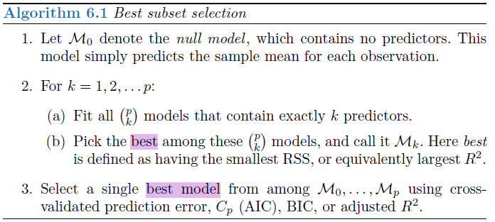

##Chapter Purpose: 
####Prediction Accuracy: 
1. n >> p: the LEAST SQUARES estimates tend to also have low variance, and hence will perform well on test observation
2. n not >> p: a lot of variability in the LEAST SQUARES fit --> overfitting --> poor prediction 
3. n < p: the variance is infinite so the LEAST SQUARES cannot be used at all. By constraining or shrinking the estimated coef, we can often substantially reduce the variance at the cost of a negligible increase of bias. (Not sure how to make estimation from this condition. )

####Model Interpretability: 
| Methods | Select Judgement | Fault | Merit | R_function |
| --- | --- | --- | --- | --- |
| Subset Selection | CV prediction error, C<sub>p</sub>, BIC, or ajusted R<sup>2</sup> | computational limitations: the number of possible models that must be considered grwos rapidly as *p* increases.It becomes computationally infeasible for values of p greater than 40 | simple and conceptually appealing approach | regsubsets()/ *leaps library* |
| Shrinkage | --- | --- | --- | --- |
| Dimension Reduction | --- | --- | --- | --- |

###Subset Selection<Page 219>
####1. Best Subset Selection
####from page 219 lab from 258   

Algorithm 6.1


**Lab.6.5.1: Best Subset Selection**
*purpose:* to practice the best subset selection  
*method:* to make split the dataset into two part.   
*result:* the poly(horsepower, 2) show more lower error rate. 
```{r}
library(ISLR)
names(Hitters)
sum(is.na(Hitters))
Hitters = na.omit(Hitters)
dim(Hitters)
```