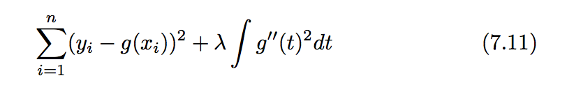

####Purpose: 
Fit non-linear model
####Data: 
Wage in library(ISLR)

| No. | Regression | relation/ merit | Suggestion | Function Related |
| --- | --- | --- | --- | --- |
| 1 | Polynomial regression (Page 280) | --- | unusual to use d greater than 3 or 4 because of overly flexible | --- |
| 2 | Step functions (Page 282) | --- | "suggestion" | cut() to get the x, lm() to get the fit |
| 3 | Regression splines | extension of item 1 and item 2, => flexible than them | Number and Location of knots:  more knots where the function might vary most rapidly, and fewer knots in the place where stable; To decide how many knots need to use CV| bs() - default is poly(x, 3): generates the entire matrix of basis function for splines w/ the specified set of knots, eg. lm(y ~ bs(x, knots = c(25, 40, 60)), data = Wage) / attr(bs(Wage$age, df = 6), "knots") this is to get the recommendation on the knots location/ ns() for the natural spline, eg lm(wage~ns(age, df = 4),data = Wage), as for the degree of the ns please refer to the page 289, note 4 (bottom of the page)|
| 4 | Smoothing splines | similar to item 3 | want to make RSS (function 7.11 left part) to be to be small and also smooth. / g''(t) is a measure of its roughness/ integral(g''(t)^2dt) is a measure of the total change in the the function g'(t). That is if g smooth, g'(t) would close to constant, then integral(g''(t)^2dt) small value; vice verse, for lager lambda,  there will be smoother g/ lambda controls the bias-variance trade-off of the smoothing spline/ lambda controls the roughness of the smoothing spline and the effective degrees of freedom./ Use LOOCV to choose lambda |smooth.spline(age, wage, cv = True)|
| 5 | Local regression | similar to item 3 and item, one important difference, regions are allowed to overlap | compute the fit at a target point x0 using only nearby training observation/ the most important is to choose span s, which control the flexibility of the non-linear fit. The method is CV/ perform poorly if p is much larger than about 3 or 4, due to very few training observations close to x0 | loess(wage ~ age, span = .2, data = Wage)/ predict(fit, data.frame(age = age.grid))  |
| 6 | Generalized additive models | allow us to extend the methods all above to deal w/ multiple predictors / can be applied "quantitative" and "qualitative" / merit 1: fit a non-linear f<sub>j</sub> to each X<sub>j</sub> ==> not need to try different transformations on each variable individually; merit 2: potentially make more accurate predictions for reponse Y; merit 3: able to examine the effect of each X<sub>j</sub> on Y individually while holding all of the other variables fixed ==> useful representation for inference; merit 4: the smoothness of the function f<sub>j</sub> for the variable X<sub>j</sub> can be summized via degrees of freedom. disadvantage: important interactions can be missed. However, we can manually add interaction terms to the GAM model by including additional predictors of the form X<sub>j</sub> x X<sub>k</sub> |"suggestion" | lm(wage ~ ns(year, 4) + ns(age, 5) + education, data = Wage); library(gam) -> gam(wage ~ s(year, 4) + s (age, 5) + education, data = Wage) [s is smooth.spline]; lo() local regression, and could be used in the gam() function just as ns() / predict(fit, newdata = Wage) // logistic regression GAM: gam(I(wage> 250) ~ year + s(age, df = 5) + education, family = binomial, data = Wage|

Function:   



####Lab 
**Lab.7.8.1: Polynomial & Step Function (Page 302) *7.8.1 Polynomial Regression and Step Functions*
*purpose:* produce the Figure 7.1    
*data:*   
*note:* 
*try-out:* 

* w/ raw = T or not, will impact the predict result, or not? for the first fit, it won't, but what about others? 
    * the result of the prediction is exact the same. 
    * also in the page 303, the last code also indicate the same thing. 
    
* How to get the degree of poly
    * anova (fit.1, fit.2, fit.3, ... ) / Page 304
    * coef(summary(fit.3)) / Page 304 / same as the anova result. Pr @ anova = Pr @ summary & Sum of Sq @ anova = t value ^ 2 @ summary
    * if there is only one predictor, the above two are same; but if there are some predictor added into the fit, anova will be more direct to get the result. 
    * Note: fit.1 must be the subset of the predictors in fit.2....
    * Try: why not cross validation? 
        * both 10-folder CV and 2-folder CV's result is: poly 4 and poly 5 are better, which is different than the anova. 
        * ?? why CV could not have the same answer as the anova?? ==> what is the different between CV and ANOVA.
            * Guess the answer is: CV is to find the best lowest test error predictors, ANOVA is to find in which predictor combination, the mean and the std will be in large difference. 
            * But in the page 305, it mentioned that we could use the CV, however, the result is not as same as the ANOVA
        * ?? still not sure how to make the prediction on the step (cut function)
    
    

```{r}
library(ISLR)
fit = lm(wage ~ poly(age, 4), data = Wage)
coef(summary(fit))

fit2 = lm(wage ~ poly(age, 4, raw = T), data = Wage)
coef(summary(fit2))

#wendy try to verify if fit == fit2
train = sample(1:nrow(Wage), nrow(Wage)/2)
test = -(train)
fit = lm(wage ~ poly(age, 4), data = Wage[train,])
fit1 = lm(wage ~ poly(age, 4, raw = T), data = Wage[train, ])
fit.pre = predict(fit, Wage[test, ])
fit1.pre = predict(fit1, Wage[test, ])
head(fit.pre)
head(fit1.pre)

mean((fit.pre - Wage[test, ]$wage)^2)
mean((fit1.pre - Wage[test, ]$wage)^2)
# try end

agelims = range(Wage$age)
age.grid = seq(from = agelims[1], to = agelims[2])
preds = predict(fit, newdata = list(age=age.grid), se=TRUE)

se.bands = cbind(preds$fit + 2*preds$se.fit, preds$fit - 2*preds$se.fit)

par(mfrow = c(1, 2), mar=c(4.5, 4.5, 1, 1), oma = c(0, 0, 4, 0))
plot(Wage$age, Wage$wage, xlim = agelims, cex = .5, col = "darkgrey")
title("Degree-4 Polynomial", outer = T)
lines(age.grid, preds$fit, lwd = 2, col = "blue")
matlines(age.grid, se.bands, lwd = 1, col = "blue", lty = 3)

# get the degree of poly by anova, and summary...
fit.1 = lm(wage ~ age, data = Wage)
fit.2 = lm(wage ~ poly(age, 2), data = Wage)
fit.3 = lm(wage ~ poly(age, 3), data = Wage)
fit.4 = lm(wage ~ poly(age, 4), data = Wage)
fit.5 = lm(wage ~ poly(age, 5), data = Wage)
anova(fit.1, fit.2, fit.3, fit.4, fit.5)

coef(summary(fit.5))

fit.1 = lm(wage ~ education + age, data = Wage)
fit.2 = lm(wage ~ education + poly(age, 2), data = Wage)
fit.3 = lm(wage ~ education + poly(age, 3), data = Wage)
anova(fit.1, fit.2, fit.3)
coef(summary(fit.3))

# wendy try the CV to get the degree of poly 
# 2-folder of CV's result is poly 4, and 5 is bettern. 
set.seed(1)
train = sample(1:nrow(Wage), nrow(Wage)/2)
test = -(train)
fit.1 = lm(wage ~ age, data = Wage[train,])
fit.2 = lm(wage ~ poly(age, 2), data = Wage[train,])
fit.3 = lm(wage ~ poly(age, 3), data = Wage[train,])
fit.4 = lm(wage ~ poly(age, 4), data = Wage[train,])
fit.5 = lm(wage ~ poly(age, 5), data = Wage[train,])

pre.1 = predict(fit.1, newdata = Wage[test, -12])
pre.2 = predict(fit.2, newdata = Wage[test, -12])
pre.3 = predict(fit.3, newdata = Wage[test, -12])
pre.4 = predict(fit.4, newdata = Wage[test, -12])
pre.5 = predict(fit.5, newdata = Wage[test, -12])

test.err.1 = mean((pre.1 - Wage[test, 12])^2)
test.err.2 = mean((pre.2 - Wage[test, 12])^2)
test.err.3 = mean((pre.3 - Wage[test, 12])^2)
test.err.4 = mean((pre.4 - Wage[test, 12])^2)
test.err.5 = mean((pre.5 - Wage[test, 12])^2)
c(test.err.1, test.err.2, test.err.3, test.err.4, test.err.5)


# 10 fold cv
k = 10
folds = sample(1:k, nrow(Wage), replace = TRUE)
cv.err = matrix(NA, k, 5, dimnames = list(NULL, paste(1:5)))
for (j in 1:k){
    fit.1 = lm(wage ~ age, data = Wage[folds != j, ])
    fit.2 = lm(wage ~ poly(age, 2), data = Wage[folds != j, ])
    fit.3 = lm(wage ~ poly(age, 3), data = Wage[folds != j, ])
    fit.4 = lm(wage ~ poly(age, 4), data = Wage[folds != j, ])
    fit.5 = lm(wage ~ poly(age, 5), data = Wage[folds != j, ])
    
    cv.err[j, 1] = mean((Wage[folds == j, 12] - predict(fit.1, Wage[folds == j, -12]))^2)
    cv.err[j, 2] = mean((Wage[folds == j, 12] - predict(fit.2, Wage[folds == j, -12]))^2)
    cv.err[j, 3] = mean((Wage[folds == j, 12] - predict(fit.3, Wage[folds == j, -12]))^2)
    cv.err[j, 4] = mean((Wage[folds == j, 12] - predict(fit.4, Wage[folds == j, -12]))^2)
    cv.err[j, 5] = mean((Wage[folds == j, 12] - predict(fit.5, Wage[folds == j, -12]))^2)
}
mean.cv.err = apply(cv.err, 2, mean)
mean.cv.err
# wendy try the CV END

# predict whether an individual earns more than $250k per year. 
head(Wage)
fit = glm(I(wage > 250) ~ poly(age, 4), data = Wage, family = binomial)
preds = predict(fit, newdata = list(age = age.grid), se = T)
# transformation the prediction
pfit = exp(preds$fit)/ (exp(preds$fit) + 1)
se.bands.logit = cbind(preds$fit + 2 * preds$se.fit, preds$fit - 2 * preds$se.fit)
se.bands = exp(se.bands.logit)/(1+exp(se.bands.logit))

preds = predict(fit, newdata = list(age = age.grid), type = "response", se = T)

plot(Wage$age, I(Wage$wage>250), xlim = agelims, type = 'n', ylim = c(0, .2))
points(jitter(Wage$age), I((Wage$wage>250)/5), cex = .5, pch = "|", col = "darkgrey")
lines(age.grid, pfit, lwd = 2, col = 'blue')
matlines(age.grid, se.bands, lwd = 1, col = 'blue', lty = 3)

# step functions
table(cut(Wage$age, 4))
fit = lm(wage ~ cut(Wage$age, 4), data = Wage)
coef(summary(fit))

# I just expect one data, but why there are so many prediction? 
head(predict(fit, newdata = list(age = 35)))

``` 

**Lab.7.8.2: Splines (Page 307)*
*purpose:*   
*data:*   
*note:* 
*try-out:* 
```{r}
# regression spline
library(splines)
fit = lm(wage ~ bs(age, knots = c(25, 40, 60)), data = Wage)
pred = predict(fit, newdata = list(age = age.grid), se = T)
plot(Wage$age, Wage$wage, col = "gray")
lines(age.grid, pred$fit, lwd = 2)
lines(age.grid, pred$fit - 2*pred$se, lty = "dashed")
lines(age.grid, pred$fit + 2*pred$se, lty = "dashed")

dim(bs(Wage$age, knots = c(25, 40, 60)))
attr(bs(Wage$age, df = 6), "knots")

fit2 = lm(wage ~ ns(age, df = 4), data = Wage)
pred2 = predict(fit2, newdata = list(age = age.grid), se = T)
lines(age.grid, pred2$fit, col = "red", lwd = 2)

# smooth splines (page 307)
plot(Wage$age, Wage$wage, xlim = agelims, cex = .5, col = "darkgrey")
title("Smoothing Splines")
fit = smooth.spline(Wage$age, Wage$wage, df = 16)
fit2 = smooth.spline(Wage$age, Wage$wage, cv = TRUE)
fit2$df
lines(fit, col = "red", lwd = 2)
lines(fit2, col = "blue", lwd = 2)
legend("topright", legend = c("16 DF", "6.8 DF"), col = c("red", "blue"), lty = 1, lwd = 2, cex = .8)

# local regression page 308
plot(Wage$age, Wage$wage, xlim = agelims, cex = .5, col = "darkgrey")
title("Local Regression")
fit = loess(wage ~ age, span = .2, data = Wage)
fit2 = loess(wage ~ age, span = .5, data = Wage)
lines(age.grid, predict(fit, data.frame(age = age.grid)), col = "red", lwd = 2)
lines(age.grid, predict(fit2, data.frame(age = age.grid)), col = "blue", lwd = 3)
legend("topright", legend = c("Span = .2", "Span = .5"), col = c("red", "blue"), lty = 1, lwd = 2, cex = .8)
```

**Lab.7.8.3: GAM (Page 308)*
*purpose:*   
*data:*   
*note:* 
*try-out:* 
```{r}
gam1 = lm(wage ~ ns(year, 4) + ns(age, 5) + education, data = Wage)
library(gam)
gam.m3 = gam(wage ~ s(year, 4) + s(age, 5) + education, data = Wage)
par(mfrow = c(1, 3))
plot(gam.m3, se = TRUE, col = "blue")
plot.gam(gam1, se = TRUE, col = "red")

gam.m1 = gam(wage ~ s(age, 5) + education, data = Wage)
gam.m2 = gam(wage ~ year + s(age, 5) + education, data = Wage)
anova(gam.m1, gam.m2, gam.m3, test = "F")

summary(gam.m3)

preds = predict(gam.m2, newdata = Wage)

gam.lo = gam(wage ~ s(year, df =4) + lo(age, span = .7) + education, data = Wage)
plot.gam(gam.lo, se = TRUE, col = "green")

gam.lo.i = gam(wage ~ lo(year, age, span = .5) + education, data = Wage)
library(akima)
plot(gam.lo.i)

gam.lr = gam(I(wage>250) ~ year + s(age, df = 5) + education, family = binomial, data = Wage)
par(mfrow = c(1, 3))
plot(gam.lr, se = T, col = "green")

table(Wage$education, I(Wage$wage > 250))
gam.lr.s = gam(I(wage > 250) ~ year + s(age, df = 5) + education, family = binomial, data = Wage, subset = (education != "1. < HS Grad"))
plot(gam.lr.s, se = T, col = "green")
``` 
stop in page 296, complete the local regression
lab stop in the page 307, local regression spline()

Notice:

* glm() prediction function. Need to transform from log to the normal scale. Refer to the page 305 to page 306