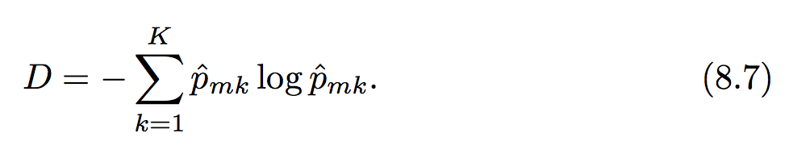

####Purpose: 
Decision Tree (Page 317)  
Bagging
Random Forests
Boosting

####Data: 
Hitters
Carseats

| No. | Regression | relation/ merit | Flaws | Suggestion | Function Related |
| --- | --- | --- | --- | --- | --- |
| 1 | Decision Tree (Regression Trees) | easier to interpret and have nice graphical representation | Easy to overfit; High Variance; a smaller tree with fewer splits may lead to lower variance and better interpretation at the cost of a little bias. | top-down, greedy approach (which is known as recursive binary splitting, and at each step of the tree building process, the best split is made as that particular step) / every steps' cutpoint needs to lead to the greatest pssible reduction in RSS. / To make smaller tree, one good way is to build a very large tree, and then prune it back. The method is to select a subtree that leads to the lowest test error rate by cost complexity pruning (weakest link pruning) function 8.4 / use CV to get the alpha, then retrun to the full data set and obtain the subtree corresponding to this alpha like algorithm 8.1| Build: tree() under the library(tree)/ plot(tree.lm) / text(tree.lm, pretty = 0) //Prune: cv.tree(FUN = prune.misclass) to determine the optimal level of tree complexity, the FUN argument is to indicate that we want the classification error rate to guide the cv and pruning process, then apply the function: prune.misclass(tree.carseats, best = 9) to prune the tree |
| 2 | Decision Tree (classification trees) | same as above | same as above, just use classification error rate to replace the RSS; however, classification error is not sufficiently sensitive for tree-growing, in practice two other measures are preferable, as function 8.6 and 8.7. When building a classification tree, either the Gini index or the cross-entropy are used to evaluate the quality of a particular split. Classification error rate is preferalbe to prune the tree if prediction accuracy of the final pruned tree is the goal. | --- | --- |
| 3 | Bagging/ Bootstrap aggregation | reduce the variance/ improve predictions/ when *B* sufficiently large, OOB error is virtually equivalent to leave-one-out cross validation error. | difficult to interpret the resulting model | bootstrap, by taking repeated samples from the training data set, and then train the method on the *b*th bootstrapped training set and finally average all the predictions. So, OOB approach for estimating the test error is particularly convenient when performing bagging  on large data sets for CV would be computationally onerous. | randomForest() / under the package of randomForest; importance() is to view the importance of variable; varImpPlot() is to make the plot on the importance. |
| 4 | Random Forests | improvement over bagged trees by way of a small tweak that decorrelates the trees | --- | --- | same as Bagging |
| 5 | Boosting | --- | --- | works in a similar way as Bagging, except that trees are grown sequentially, which means each tree is grown using information from previously grown trees. (Bagging: each tree is built on a bootstrap data set, independent of the other trees.) Boosting's each tree is fit on a modified version of the original data set. | gbm(distribution = "gaussian" (regression problem)/ distribution = "bernoulli" (classification problem), n.trees = x (x trees we want), interaction.depth = n (limits the depth of each tree), shrinkage = .2 (default of the value is .001)) under the package of gbm |

####Function/ Algorithm: 

* Function 8.4: alpha is to control a trade-off between the subtree's complexity and its fit to the training data. / T is the number of terminal nodes of the tree T. 


* Algorithm 8.1


* Function 8.6: Gini index will take a small value if all the p<sub>mk</sub> are close to zero or one. This could be used to check the node purity. 


* Function 8.7: Cross Entropy will take on  a value near zero if all the p<sub>mk</sub> are all near one or zero. This also could be used to check the node purity.


####Lab:
Page 337

**Lab.8.3.1: Fitting Classification Trees*
*purpose:* fit classification trees    
*data:*   
*note:* 
*try-out:* 
```{r}
library(ISLR)
library(tree)
High = ifelse(Carseats$Sales <= 8, "No", "Yes")
Carseats = data.frame(Carseats, High)
tree.carseats = tree(High ~ .-Sales, Carseats)
summary(tree.carseats)
plot(tree.carseats)
text(tree.carseats, pretty = 0)
tree.carseats

# use check the test error
set.seed(2)
nrow(Carseats)
train = sample(1 : nrow(Carseats), 200)

Carseats.test = Carseats[-train, ]
High.test = High[-train]

tree.carseats = tree(High ~ .-Sales, Carseats, subset = train)
tree.pred = predict(tree.carseats, Carseats.test, type = "class")

table(tree.pred, High.test)

# use cv to prune tree
set.seed(3)
cv.carseats = cv.tree(tree.carseats, FUN=prune.misclass)
names(cv.carseats)
cv.carseats

par(mfrow = c(1, 2))
plot(cv.carseats$size, cv.carseats$dev, type = "b")
plot(cv.carseats$k, cv.carseats$dev, type = "b")

par(mfrow = c(1, 1))
prune.carseats = prune.misclass(tree.carseats, best = 9)
plot(prune.carseats)
text(prune.carseats, pretty= 0)

tree.pred = predict(prune.carseats, Carseats.test, type = "class")
table(tree.pred, High.test)
```

**Lab.8.3.2: Fitting Regression Trees*
*purpose:* fit regression trees    
*data:* Boston  
*note:* 
*try-out:* 
```{r}
set.seed(1)
train = sample(1 : nrow(Boston), nrow(Boston)/2)
tree.boston = tree(medv ~ ., Boston, subset = train)
summary(tree.boston)
plot(tree.boston)
text(tree.boston, pretty = 0)

cv.boston = cv.tree(tree.boston)
plot(cv.boston$size, cv.boston$dev, type = 'b')

prune.boston = prune.tree(tree.boston, best = 5)
plot(prune.boston)
text(prune.boston, pretty = 0)

yhat = predict(tree.boston, newdata = Boston[-train, ])
boston.test = Boston[-train, "medv"]
plot(yhat, boston.test)
abline(0, 1)
mean((yhat - boston.test) ^ 2)
```

**Lab.8.3.3: Bagging and Random Forests*
*purpose:* fit regression trees    
*data:* Boston  
*note:* 
*try-out:* 
```{r}
library(randomForest)
set.seed(1)
bag.boston = randomForest(medv ~ ., data = Boston, subset = train, mtry = 13, importance = TRUE)
bag.boston

yhat.bag = predict(bag.boston, newdata = Boston[-train, ])
plot(yhat.bag, boston.test)
abline(0, 1)
mean((yhat.bag - boston.test) ^ 2)

# set the ntree
bag.boston = randomForest(medv ~ ., data = Boston, subset = train, mtry = 13, ntree = 25)
yhat.bag = predict(bag.boston, newdata = Boston[-train, ])
mean((yhat.bag - boston.test)^2)
bag.boston

# radomForest
set.seed(1)
rf.boston = randomForest(medv ~ ., data = Boston, subset = train, mtry = 6, importance = TRUE)
yhat.rf = predict(rf.boston, newdata = Boston[-train, ])
mean((yhat.rf - boston.test) ^2)

importance(bag.boston)
varImpPlot(bag.boston)
```

**Lab.8.3.4: Boosting*
*purpose:*    
*data:* Boston  
*note:* 
*try-out:* 
```{r}
install.packages("gbm")
library(gbm)
set.seed(1)
boost.boston = gbm(medv ~ ., data = Boston[train, ], distribution = "gaussian", n.trees = 5000, interaction.depth = 4)

summary(boost.boston)

par(mfrow = c(1, 2))
plot(boost.boston, i = "rm")
plot(boost.boston, i = "lstat")

yhat.boost = predict(boost.boston, newdata = Boston[-train, ], n.trees = 5000)
mean((yhat.boost - boston.test)^2)

# change the shrinkage
boost.boston = gbm(medv ~., data = Boston[train, ], distribution = "gaussian", n.trees = 5000, interaction.depth = 4, shrinkage = .2, verbose = F)
yhat.boost = predict(boost.boston, newdata = Boston[-train, ], n.trees = 5000)
mean((yhat.boost - boston.test) ^2)
```

Context stopped in page 330
Lab: page 344 Bagging/ Random Forest/ Boosting. 